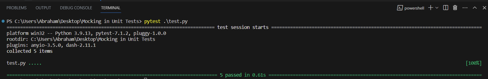

Mocking Illustration Repository
Welcome to the Mocking Illustration Repository! This repository contains a set of Python scripts designed to demonstrate the concept of mocking in unit testing. Additionally, an accompanying article has been written to provide context and insights into the code presented here.

Article Reference
To delve deeper into the concepts covered in this repository, please refer to the following article: Link to Article

Getting Started
To run the provided code examples and unit tests, follow the simple steps outlined below:

- Clone this repository to your local system.
- Open a terminal (from your preferred IDE) and navigate to the root folder of the cloned repository.
- Run the following command to execute the unit tests: pytest ./test.py
- If everything is set up correctly, you should see all five unit tests within test.py pass, resulting in a 100% success outcome (as shown in the image below).

Prerequisites
Before running the code, ensure you have the following Python libraries installed:

- pandas
- requests
- sqlite3
- you'll also need an IDE (In my case, I used Visual Studio Code)

Contact
If you have any questions about the concepts covered in the article or encounter any confusion while exploring the code, feel free to reach out via email: enyoone3@gmail.com. Your inquiries will be warmly welcomed.

Here's to an enjoyable and enlightening learning experience with unit testing and mocking in Python!

Cheers,
Abraham Enyo-one Musa.